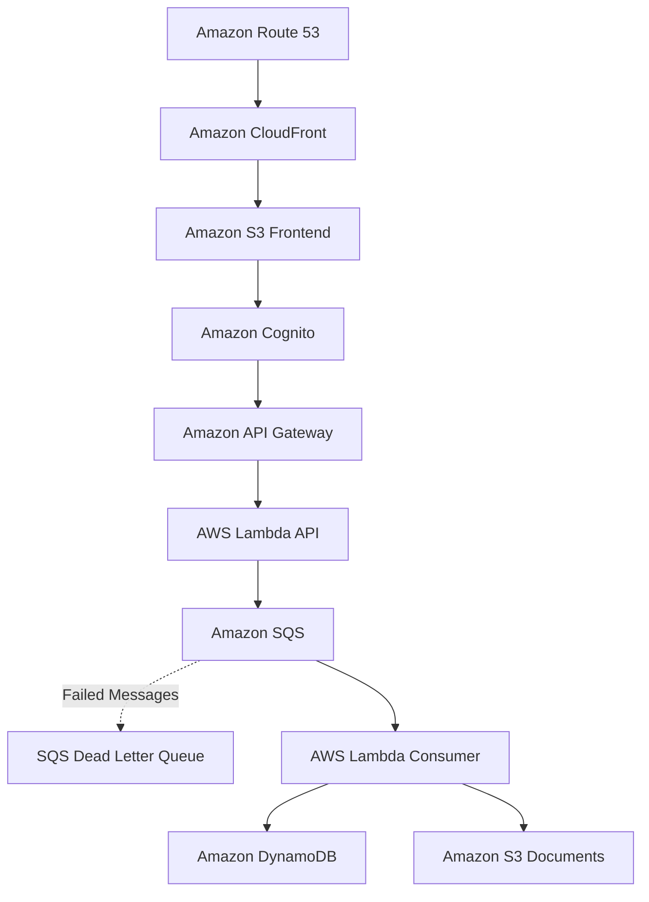

```mermaid
flowchart TD
    R53[Amazon Route 53]
    CF[Amazon CloudFront]
    S3FE[Amazon S3 Frontend]
    COG[Amazon Cognito]
    APIGW[Amazon API Gateway]
    LAPI[AWS Lambda API]
    SQS[Amazon SQS]
    DLQ[SQS Dead Letter Queue]
    LCON[AWS Lambda Consumer]
    DDB[Amazon DynamoDB]
    S3[Amazon S3 Documents]

    R53 --> CF
    CF --> S3FE
    S3FE --> COG
    COG --> APIGW
    APIGW --> LAPI
    LAPI --> SQS

    SQS --> LCON
    SQS -. Failed Messages .-> DLQ

    LCON --> DDB
    LCON --> S3
```
