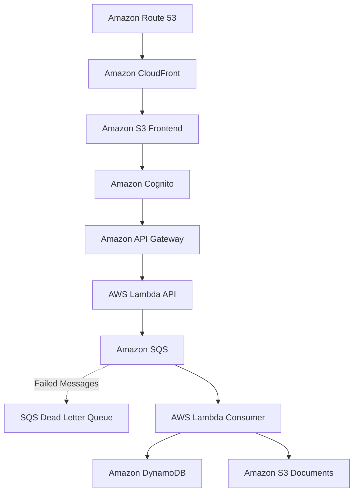

## Phase 11 follow-ups (tracked, not built)

- **Presigned PUT replay.** One presigned URL can be PUT repeatedly within
  `upload_url_ttl_seconds` (currently 900s), and every PUT re-triggers
  S3 → SQS → Textract without going back through API Gateway's rate limit.
  Quick fix: shorten the TTL. Real fix: have the consumer skip keys it has
  already processed.
- **Direct `lambda:Invoke` bypasses the concurrency cap.** `maximum_concurrency`
  on the SQS event source mapping only limits SQS-triggered runs. Low risk,
  because a direct invoke already needs IAM access to the account.
- **Real-time runaway alarm.** A CloudWatch alarm on queue depth or consumer
  invocation rate would catch a loop within minutes. AWS Budgets can lag by
  about 24h, so it is only a backstop.
- **IAM least privilege (next major item).** Split the shared Lambda role into
  `api_lambda_role` and `consumer_lambda_role`, remove the unused
  `sqs:SendMessage` and `dynamodb:GetItem` permissions, and scope logging to
  specific log groups. Afterwards, re-run the full Phase 10 checks: the browser
  presign path and the uppercase `.PDF` case.
