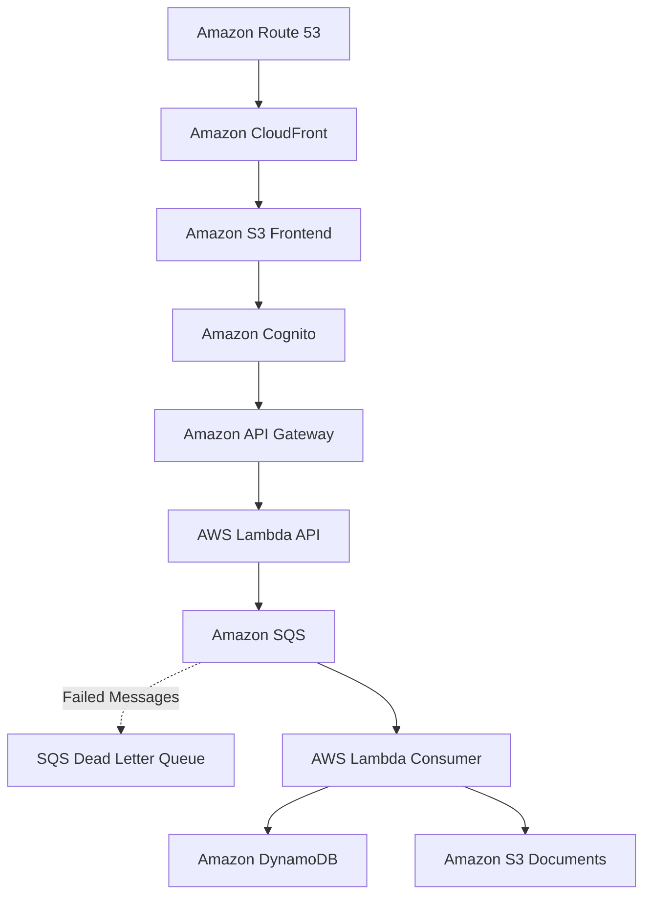

## Phase 11: Security and cost guardrails (done)

**Built**

- API Gateway stage throttling (burst 20, rate 10).
- Consumer concurrency cap: `maximum_concurrency = 2` on the SQS event source
  mapping.
- Whole-account monthly budget ($10; alerts at 80% actual and 100% forecasted).
- One IAM role per Lambda, replacing the shared role:
  - API: `dynamodb:PutItem`/`Query`, `s3:PutObject` on `uploads/*`, its own
    log group.
  - Consumer: SQS receive/delete/attributes, `dynamodb:UpdateItem`,
    `s3:GetObject` on `uploads/*`, `textract:AnalyzeExpense`, its own log
    group.
  - Dropped: `AWSLambdaBasicExecutionRole`, `sqs:SendMessage`,
    `dynamodb:GetItem`.
- Re-verified after the split: browser presign upload, uppercase `.PDF`,
  Textract rejection reaching `FAILED` with one attempt and an empty DLQ, log
  delivery, and zero AccessDenied errors in either function.

**Learned**

- Give each function its own least-privilege role, scoped to what its code
  (and, for the consumer, the SQS poller) actually calls.
- Put `depends_on` on the role policy in each function, so a function never
  switches to a role that has no policy attached yet.
- The IAM policy simulator can't verify log-stream permissions. Check log
  delivery at runtime instead.
- When the account's concurrency limit is 10, cap the consumer with
  `maximum_concurrency` on the event source mapping. Reserved concurrency
  doesn't work at that limit.

**Deferred**

- **Presigned PUT replay.** One presigned URL can be PUT repeatedly within
  `upload_url_ttl_seconds` (currently 900s), and every PUT re-triggers
  S3 → SQS → Textract without going back through API Gateway's rate limit.
  Shortening the TTL is a low-risk mitigation. The real fix is having the
  consumer skip keys it has already processed.
- **Direct `lambda:Invoke` bypasses the concurrency cap.** `maximum_concurrency`
  on the SQS event source mapping only limits SQS-triggered runs. Low risk,
  because a direct invoke already needs IAM access to the account.
- **Real-time runaway alarm.** A CloudWatch alarm on queue depth or consumer
  invocation rate would catch a loop within minutes. AWS Budgets can lag by
  about 24h, so it is only a backstop.
- **`terraform fmt -check`** flags `cognito.tf`, `outputs.tf` and `test.tfvars`.
  This predates Phase 11.
- **Human admin IAM user.** `chinyanghsiao` has `IAMFullAccess` and several
  AWS-managed FullAccess policies attached directly. Decide whether to narrow
  it to scoped inline policies, like the existing `ACMAccess`,
  `cloudwatch-alarms-management` and `budgets-management`.
